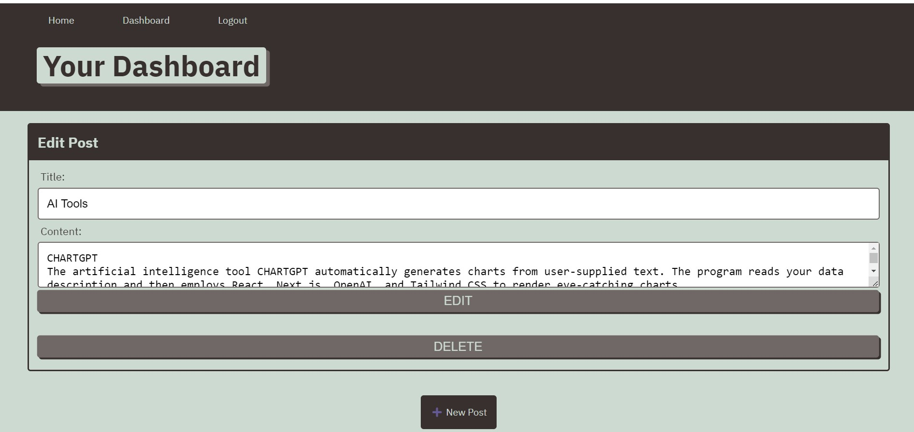

# MAUGB-M14C-MVC-Model-View-Controller-Tech-Blog
Model-View-Controller (MVC) Tech Blog

## Description

This application uses Model view controller framework to create a Tech-blog.
Application is a full-stack web application, using modularization to log-in user.
This application is created using MySQL for the database to collect and poste data from user. Using handlebars for dynamic render.  
Server and routes are created to manage the interaction between the view and the model, data information is managed and updating the database.

Create a full stack application, using controllers, server and config.
Application that allows the user input the information for specific tech topic, data is recorded and posted. User is able to manage the information updating, edit or deleting the post. 
The application uses JavaScript, Express, MySQL, Sequelize, handlebars and environmental variables. 
On the back end is using NodeJS and server routing for application.

Create a full stack application, user can be able to log in, log out, or log -up if is a new user.
Also, users can create content and share experience or new information thru a front-end website which data and records are being processed on the back end and database.
Modularization allows us to manage multiple sections of the application while having communication through the routers.
This program shows the use of NodeJS as backend JavaScript to be able to execute the JavaScript code and use of MySQL to create and manage information from database and corresponding tables. 
Connection to the application, use schema.sql and seeds.sql for database, tables and data.

With this application I learned how to implement the model view controller framework in a full stack web application.
Use the handlebars for rendering dynamic HTML.
Use of helpers and pass data for application operation
Use of serialization of data
I learned the use of MySQL , Inquire and  NodeJS to write the server file using JavaScript.
Use of schema to create the tables, Use of primary keys.
Create a back-end application, set-up a server, MySQL and server route for Application. 

## Table of Contents (Optional)

If your README is long, add a table of contents to make it easy for users to find what they need.

- [Installation](#installation)
- [Usage](#usage)
- [Credits](#credits)
- [License](#license)

## Installation

What are the steps required to install your project? Provide a step-by-step description of how to get the development environment running.

HEROKU Deployed Link:

https://gentle-beyond-81336.herokuapp.com/

      ## Usage

## Credits

-	Generate license badge: https://shields.io/ .  
-	Use of NodeJS   16.16.0
-	Use of JavaScript
-	Use of inquirer 8.2.0
-	Use of mysql2 2.2.5
-	Use of express 4.17.1
-	Use of express-session 1.17.1
-	Use of sequelize 6.21.3
-	Use of connect-session-sequelize 7.0.4
-	Use of dotenv 8.2.0
-	Use of env 0.0.2
-	Use of express-handlebars 5.2.0
-   Use of Heroku to deploy application
-   Use of GitHub for repostory

## License

This program runs under the MIT license.
    MIT
    
  

## Features

Sign-up option for new user
Sign-in option for existing user
Controllers’ routes for comment, user, post, dashboard and home.
New comment information and post
User option for editing a comment.
User option to delete a post.
Application running on front end and backend on localhost.
Comment information is saved into database file
Routers created for communication between application and database on back-end.
Dashboard with all Tech blog posts

## How to Contribute

If you would like to contribute please send an e-mail to gomezb_mauricio@hotmail.com. Please share your GitHub repository name and your message.

Contact:

gomezb_mauricio@hotmail.com
https://github.com/MauricioGB1

